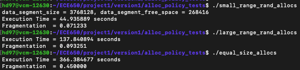
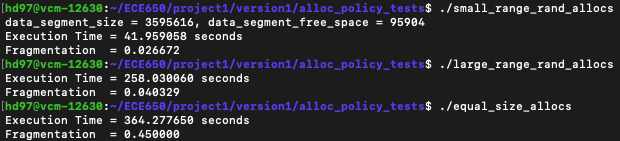

## Report#1: Malloc Library Part 1 

##### Hongliang Dong (hd97)

### 1. Implementation

#### 1.1 Data Structure

The goal of this project is to implement own versions of memory allocation and free functions. One of the key points is to design an appropriate data structure to store important information of the allocated memory blocks. The data strcture I used for this project named `block_t` is shown below. It has four fields. The first one `size` is used to store how many bytes allocated in the memory block. The second one `free` is used to indicate the corresponding block is whether free or not. The third and fourth fields are `next` and `prev`. They are pointers pointing to the next or previous `block_t` and they are used to navigate to the adjacent memory blocks. 

```c++
struct block_tag{
  size_t size;
  int free;
  struct block_tag* next;
  struct block_tag* prev;
};
typedef struct block_tag block_t;
```

#### 1.2 Details of Implementation

My implementation is straightforward and succinct. For the function to allocate memory, the function `sbrk()` is called to allocate memory from heap when there is no enough space. When we call `sbrk()` for more memory, we actually allocate the size required plus the size of `block_t` in order to store information of each memory block for the sake of management and later modification. A double linked list with a head and tail pointer is used to link all the memory blocks. At the beginning, the head and tail pointers are initialized to `NULL` to indicate there are no memory blocks at all. Thus, we can directly allocate new memory. If there are exising memory blocks, we traverse the linked list with first fit or best fit policy depends on users to find a potential free block to reuse. Note that a policy to minimize the segment size is used here. When the size of the potential free blocks is larger than or equal to the required size plus the size of `block_t`, we satisify the requirement with this block while spilt it and indicate the rest part is free for future use. If there are no approxiate free blocks to reuse, a new memory block is allocated with the help of `sbrk()`.

For the function to free memory, we first find the corresponding block with the input pointer and then modify the field `free` from 0 to 1. Here I implement another trick to reduce the segment size as a larger size block has a higher possibility to be reused when we request memory. After setting the field `free` to 1, the `merge` function is called to merge adjacent free blocks. 

As required by the proejct, two policies, first fit and best fit, are implemented to find the potential memory blocks. Specifically, the first fit (FF) policy traverses the linked list and compares the required size with the size of the free blocks. Once FF finds one block whose size is larger than or equal to the required size, it is selected as the block to be used immediately. As mentioned above, if its size is larger than the required size by a threshold, typically the size of `block_t`, the splitting is implemented. 

The best fit (BF) policy works differently from FF. A variable for the smallest difference between the required size and the size of a block as well as a pointer to the corresponding block is stored. After traversing the linked list, the block with the smallest difference is considered as the best fit block. Similarly, the splitting is implemented if the standard meets.

Additionally, two functions to count the data segment size and free space segment size are implemented. To calculate the data segment size efficiently, simply return the difference between `sbrk(0)` and `head`. To see the free space segment size, a while loop is used to traverse the linked list and add all the sizes of each free `block_t` in the meanwhile.

### 2. Results

The run-time and fragmentation of different policies with different allocation patterns are shown as below.



<center>FF
</center>



<center>
  BF
</center>

The results are interesting to analyze. In general, from the logic of the two policies, first fit policy tends to have shorter execution time while best fit policy tends to have better memory usage (lower fragmentation). However, the result of `small_range_rand_allocs` is not as expected. BF has lower fragmentaion, which is reasonable, but takes shorter to execute. I think this is because in this case the required memory size varies in a small range. Imagine three free blocks have the size 5, 3, 7, respectively. With BF policy, when we require the size 3, 5, 7, it takes all the three buckets. However, with FF policy, it takes 5 and 7 and has to require a piece of new memory. This may account for the result that BF runs faster than FF. 

For the `large_range_rand_allocs`, BF takes much longer to run while has lower fragmentaion, which is what we expected. This is because the required memory in this case varies in a large range and the strength and weakness of each policy are extremely obvious. 

In the setting `equal_size_allocs`, all the required sizes are exactly the same. The first fit block is also the best fit block. Therefore, the two policies have almost the same execution time and exactly the same fragmentation. Since the fragmentation is calculated half way, it is resonable to be around 0.5.

Generally, I would recommend first fit policy because the `large_range_rand_allocs` setting is the closest to real cases. Most of the time the required sizes vary in a great scope. Consequently, trying to traverse and find a best fit block is difficult and meaningless. If we know ahead that the required sizes are similar, I would recommend best fit policy instead according to the experiment results.

#### 3. Potential Improvements

My implementation is simple and effective. However, the execution time seems okay but far from excellent. I come up with another structure to have another linked list linking all the free memory blocks. In this way, when allocating memory block, we only need to traverse the linked list of free blocks rather than the whole list.


