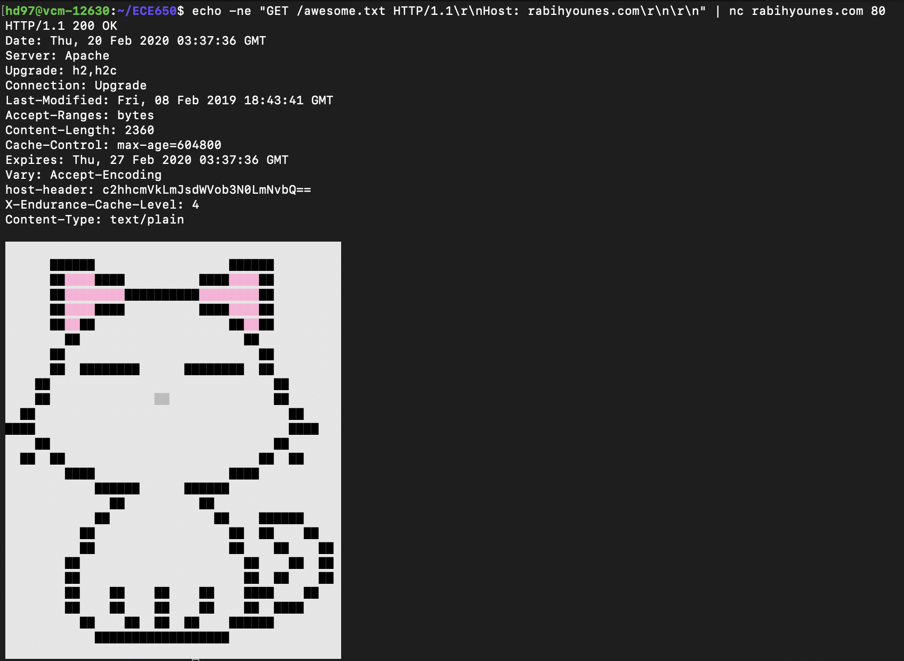

## **HW #3: Networking Questions**

#### Hongliang Dong (hd97)

1.a. <u>01111110</u> 1000111110101000111110011 <u>01111110</u>

   b. 11111110001111111

2.a. 011000111011

   b. As Hamming code has the Hamming distance 3, it can only detect single-bit errors. Therefore, I assume the received messages having at most 1 bit error and we use even parity here.

​		i. Check bits p1 and p8 indicate error, so the ninth bit is wrong. Simply flip it, the correct one should be 111000100011.

​		ii. Check bits p1, p2 and p8 indicate error, so the 11th bit is wrong. Simply flip it, the correct one should be 01110011010.

3.a. C(x) = 10101. n(x) = m(x)x^4 = 101100000. r(x) = n(x) mod C(x) = 1111. n(x) = n(x) - r(x) = 101101111, which is the encoded message.

​    b. i. The remainder of n(x) mod C(x) is 10. It is not correct.

​		ii. The remainder of n(x) mode C(x) is 0. It is correct.

4.

| Destination | Cost | Next Hop |
| :----:| :---: | :----: |
| A | 9 | D |
| B | 5 | B |
| C | 0 | \ |
| D | 5 | D |
| E | 4 | E |
| F | 9 | E |

5.

Each byte of a packet has its own sequence number and the sequence numbers are 64-bit. Therefore, the size of data is $2^{64}$ bytes, i.e. $2^{64}\times8 = 2^{67}$ bits. The optical fiber runs at $100$ Terabits per second, in other words, $100\times2^{40}$ bits/s. 

$$
lifetime=\frac{2^{67}}{100\times2^{40}}=\frac{2^{27}}{100}s=1342177.28s=372.82hours=15.53days
$$

6.

- Creation Date: 1986-06-02T04:00:00Z

- Registry Expiry Date: 2021-07-31T11:59:59Z
- DNS servers:
  - Name Server: DNS-AUTH-01.OIT.DUKE.EDU
  - Name Server: DNS-AUTH-02.OIT.DUKE.EDU
  - Name Server: DNS-NC1-01.OIT.DUKE.EDU

7.

